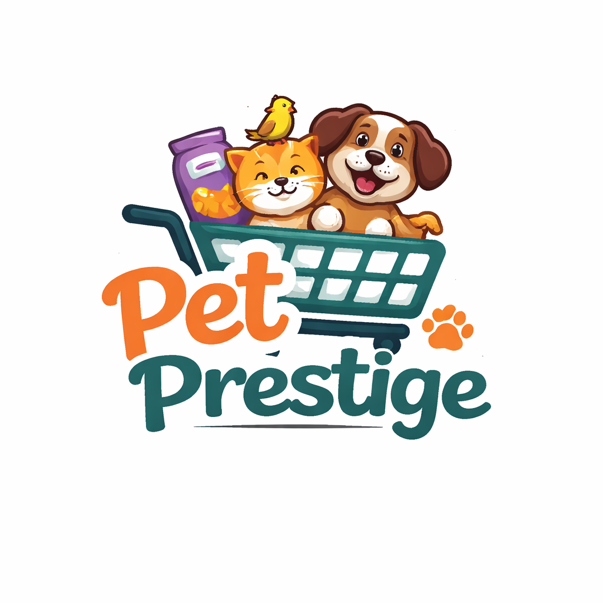

# Pet Prestige - IMPROVEMENTS PLAN
**✅ 7/8 COMPLETE** Homepage LF/community removed, 4 featured products fixed

**Information Gathered:**
- Logo PNG ready: images/logo.png → replace SVG everywhere
- Homepage: Remove LF/community, 4 featured products (JS ready)
- Learn: guide-detail.html stub → full content, DB.guides expand
- LF: 4 stub reports → 12+ real pet images/info/address
- Community: 3 stub posts → 10+ with images, own edit/delete/reply
- Profile: Messy → clean modern layout/icons
- Admin: Populate real data (orders/customers/reviews), fix graphs/search/add
- All: Professional icons, responsive buttons, modern designs

**Detailed Plan:**

### 🎨 1. Logo Update (6 files)
- index.html/shop.html/learn.html/lost-found.html/community.html/profile.html/login.html
- Replace .pet-prestige-logo SVG → 
- Admin 8 files: logo-icon → images/logo.png

### 🏠 2. Homepage Fixes
- index.html: Delete lost-found-preview + community-preview sections
- js/script.js: loadFeaturedProducts() → slice(0,4)

### 📚 3. Learn Complete
- guide-detail.html: Full content layout/related products
- js/script.js: Expand DB.guides → 12+ full articles

### 🔍 4. Lost & Found Enhanced
- js/script.js: DB.lostFound → 12+ real pet images/location/address
- lost-found.html: Icons/buttons responsive

### 👥 5. Community Fixed
- js/script.js: DB.community → 10+ posts real images
- community.html: Edit/delete own (user check), reply comments, image fix/layout clean

### 👤 6. Profile Clean
- profile.html: Modern layout/tabs/icons responsive
- js/script.js: Functional buttons

### 👑 7. Admin Data/Design
- js/script.js: Populate DB.orders/customers/reviews, dashboard real charts/lists/chats
- admin/dashboard.html/products.html/orders.html/customers.html/reviews.html/reports.html: Fix search/graph/add buttons
- All admin: "Back to Admin" button when view store

### 🔧 8. Design/CSS
- css/style.css: Modern icons, responsive buttons, creative styles

**Dependent Files:**
- js/script.js (DB content)
- css/style.css (designs)
- All HTML above

**Followup Steps:**
- Test all flows (live-server running)
- Open http://127.0.0.1:8080 → demo

**Approve proceed?** (Y/N/modify)

